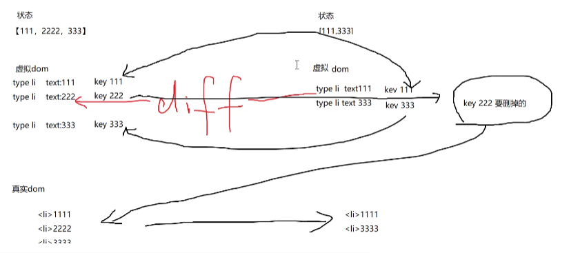
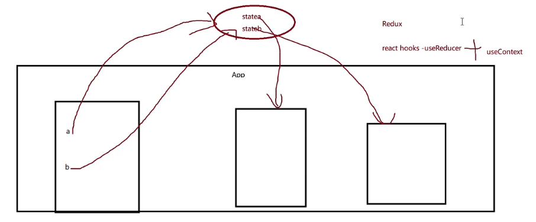
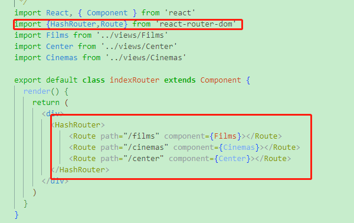

# 一、react基本介绍 #
## 1.优点 ##

① **声明式设计** - 轻松描述应用

② **高效**- react通过对dom的模拟(虚拟dom)，最大限度地减少与DOM的交互 

&emsp;**灵活**- react可以与已知库或者框架很好地配合。

③ **组件化** - 通过React构建组件，使得代码更容易得到**复用**，能够很好的应用在大项目中。

④**单项数据流** - React实现了单项响应的数据流从而简化扫了重复代码，这也是它为什么比传统数据绑定更简单；

⑤**虚拟dom** - 前端开发中 性能消耗最大的就是DOM操作。React把真是的DOM树转换成**JavaScript对象树**，也就是 **Virtual DOM** 。

&emsp;**JSX** - 是JavaScript语法的扩展。 

XML可扩展标记语言 跟 html超文本标记语言 区别  --  都是标记语言 ， html预定义 xml 自定义的...

## 2.介绍 ##

源于Facebook的内部项目，用来架设Instagram的网站；2013年5月开源。

react将界面分成了各个独立的小块，每一个块就是组件，这些组件之间可以组合、嵌套、就形成我们的页面。

### 关于react全家桶 ###
**1、react**

react的核心。

**2、redux**

redux相当于一个数据库，可以当成一个本地的数据库使用，react-redux可以完成数据订阅，redux-thunk可以实现异步的action，redux-logger是redux的日志中间件。

**3、react-router**

React Router 是专为 React 设计的路由解决方案。它利用HTML5 的history API，来操作浏览器的 session history (会话历史)。

React Router被拆分成四个包：react-router，react-router-dom，react-router-native和react-router-config。react-router提供核心的路由组件与函数。react-router-config用来配置静态路由（还在开发中），其余两个则提供了运行环境（浏览器与react-native）所需的特定组件。

进行网站（将会运行在浏览器环境中）构建，我们应当安装react-router-dom。因为react-router-dom已经暴露出react-router中暴露的对象与方法，因此你只需要安装并引用react-router-dom即可。

**4、axios**

axios是基于Promise的用于浏览器和Node.js的http客户端。可以发送get、post等http请求，用来和服务器进行交互的。

**5、antd**

Ant Degisn是个很好的React UI库，看起来跟我们熟知的bootstrap有点类似，从页面布局到按钮到文字提示泡应有尽有。

# 二、react安装 #

1.全局安装 create-react-app

	npm install -g create-react-app

2.创建一个项目

	create-react-app your-app

3.不想全局安装可以使用npx

	npx create-react-app your-app 也可以实现相同效果
    npx - 临时安装

 
安装之后这需要等待一段时间，这个过程实际上**安装三个东西**

- react:react的顶级库
-     react-dom:因为react有很多的运行环境，比如app端的react-native,我们要在web端运行就使用react-dom
- 	react-scripts:包含运行和打包react应用程序的所有脚本及配置

**PS.** npm切换为淘宝镜像 或者 yarn切换到淘宝镜像

## 三、目录介绍 ##
    README.md -- 使用方法的文档
    node_modules -- 所有的依赖安装的目录
    package-lock.json -- 锁定安装的包的版本号保证团队的依赖能保证一致
    package.json 
    public -- 静态公共目录
    src -- 开发用的源代码目录

**PS.**关于package.json与package-lock.json的区别 
1.**package-lock.json**  
存储node_modules下包的信息，包括版本号、下载地址等 
作用：锁定安装时的包版本号，需要上传到git上，以保证其他人在install时候，大家的依赖版本相同。 
2.**package.json** 
包描述文件 
作用：其实最有用的是dependencies选项，包含第三方包依赖信息 
package-lock.json跟package.json的区别在于： 

    "dependencies": {
     "@types/node": "^8.0.33",
    }

这里的^向上尖号是定义向后（新）兼容依赖，如果types/node版本是超过8.0.33，并且是在大版本（8）上相同，就允许下载最新的types/node包。同一个大版本不同版本号之间存在差异，导致依赖库包行为特征有时候不兼容。 
而package-lock.json就只会下载8.0.33版本的。 

**npm5以前** 
&nbsp;&nbsp;&nbsp;&nbsp;npm5以前，没有package-lock.json这个文件。package.json文件会记录你项目中所需要的所有模块。当你执行npm install的时候，node会先从package.json文件中读取所有dependencies信息，然后根据dependencies中的信息与node_modules中的模块进行对比，没有的直接下载，已有的检查更新。 
&nbsp;&nbsp;&nbsp;&nbsp;因为package.json只能锁定模块的大版本号（版本号的第一位），不能锁定后面的小版本，所以你每次重新npm install时候拉取的都是该大版本下面最新的版本。一般我们为了稳定性考虑我们不能随意升级依赖包，因为如果换包导致兼容性bug出现很难排查，这样很容易出现问题，所以package-lock.json就是来解决包锁定不升级问题的。另外，package.json文件只记录你通过npm install方式安装的模块信息，而这些模块所依赖的其他子模块的信息不会记录。
        
**npm5以后** 
&nbsp;&nbsp;&nbsp;&nbsp;package-lock.json文件锁定所有模块的版本号，包括主模块和所有依赖子模块。当你执行npm install的时候，node从package.json文件读取模块名称，从package-lock.json文件中获取版本号，然后进行下载或者更新。 
&nbsp;&nbsp;&nbsp;&nbsp;因此，正因为有了package-lock.json文件锁定版本号，所以当你执行npm install的时候，node不会自动更新package.json文件中的模块，必须用npm install packagename@x.x.x（指定版本号）来进行安装才会更新，package-lock.json文件中的版本号也会随着更新。

## 四、vscode 快速添加头注释 ##

- 安装 koroFileHeader
- 配置 setting.json
- 在VS Code中，依次打开 “文件(File) → 首选项(Preferences) → 设置(Settings)”,然后搜索fileheader以打开setting.json文件
- 最后在setting.json中添加如下配置命令：（配置命令可自定义修改哈，详细配置见GitHub：koroFileHeader）

    	// 头部注释
	    "fileheader.customMade": {  //快捷键 ctrl+win+i
	    "Author": "Xminyang", // 创建文件的作者
	    "Date": "Do not edit", // 文件创建时间(不变)
	    "LastEditors": "Xminyang", // 文件最后编辑者
	    // 由于编辑文件就会变更最后编辑时间，多人协作中合并的时候会导致merge
	    // 可以将时间颗粒度改为周、或者月，这样冲突就减少很多。搜索变更时间格式: dateFormat
	    "LastEditTime": "Do not edit", // 文件最后编辑时间
	    // 输出相对路径，类似: /文件夹名称/src/index.js
	    "FilePath": "Do not edit", // 文件在项目中的相对路径 自动更新
	    // 插件会自动将光标移动到Description选项中 方便输入 Description字段可以在specialOptions更改
	    "Description": "", // 介绍文件的作用、文件的入参、出参。
	    // custom_string_obkoro1~custom_string_obkoro100都可以输出自定义信息
	    // 可以设置多条自定义信息 设置个性签名、留下QQ、微信联系方式、输入空行等
	    "custom_string_obkoro1": "",
	    // 版权声明 保留文件所有权利 自动替换年份
	    "custom_string_obkoro1_copyright": "Copyright (c) ${now_year} by 用户/公司名, All Rights Reserved. "
	    },
	    // 函数注释
	    "fileheader.cursorMode": {//快捷键 ctrl+win+t
	    "description": "", // 函数注释生成之后，光标移动到这里
	    "param": "", // param 开启函数参数自动提取 需要将光标放在函数行或者函数上方的空白行
	    "return": "",
	    }

2、快捷键 
添加文件头部注释：Ctrl+Win+i 
添加函数注释：Ctrl+Win+t

## 五、开始第一个react应用 ##
react开发需要引入多个依赖文件：react.js、react-dom.js，分别又有**开发版本和生产版本**，create-react-app里已经安装好。把通过CRA创建的工程目录清空，然后里面重新创建一个index.js写入以下代码：

**知识：** 
es6中引用模块import后面加上花括号{}和不加花括号的区别 

1. import不使用花括号 

不使用{}来引用模块的情况下，**import模块时的命名是随意的**，即如

下是那种引用命名都是正确的； 

它总是会解析到A.js中默认的export default。
    
    //A.js
    export default 42
.

    export const A = 52
.

	//B.js,B.js引用A.js
	import A from './A'
	import MyA from './A'
	import Something from './A'

2.import使用花括号{} 

下面代码生效的前提是，只有在A.js中命名导出为A的export name 的代码

    //B.js
    import { A } from './A'   //正确，因为A.js中有命名为A的export
    import { myA } from './A'   //错误！因为A.js中没有命名为myA的export
    import { Something } from './A'  //错误！因为A.js中没有命名为Something的export

.开始第一个react应用

    //这部分在react17.x的版本适用
    // //引入react 核心模块
    // //从react的包当中引入了React，只要你要写React.js组件就必须引入React，
    // //因为react里有一种语法叫JSX,要写JSX就必须引入React
    // import React from "react";
    // //ReactDom 可以帮助我们把React组件渲染到页面上去，没有其他作用了。它
    // //是从react-dom中引入的
    // // import ReactDOM from "react-dom";
    
    //18.x版本更新页面渲染方式
    import React from "react";
    
    import ReactDOM from "react-dom/client";
    
    const container = document.getElementById('root');
    
    const root = ReactDOM.createRoot(container);
    
    //ReactDom里有一个render方法，功能就是把组件渲染并且构造DOM树，然后插入到页面上某个特定的元素上
    root.render(
    //这里比较奇怪了，它并不是一个字符串，看起来像是纯HTML代码写在JavaScript代码里面。
    //"在JavaScript写的标签的"语法叫JSX-JavaScript XML
    

    <h1>欢迎使用react的世界</h1>
    <h2>文件</h2>
    

    
    )

## 六、JSX语法与组件 ##
### 1.JSX语法 ###
JSX将html语法直接加入到JavaScript代码中，再通过翻译器转换到纯JavaScript后由游览器执行。在实际开发中，JSX在产品打包阶段都已经编译成纯JavaScript，编译过程由Babel的JSX编译器实现。

JSX原理 
JSX-使用react构造组件，bable进行编译->JavaScript对象->ReactDOM.render()->DOM元素->插入页面

### 2.class组件 ###
ES6的加入让JavaScript直接支持使用class来定义一个类，react创建组件的方式就是使用的类的继承，ES6 class是目前官方推荐的使用方式，它使用了ES6标准语法来构建

**react中创建组件**
组件-JS+HTML+CSS绑定到一个文件内，方便复用；

es6 类

    class Test {
    	constructor(){
    		this.a = 23;
    	}
    	testA(){
    		console.log(this.a)
    	}
    }
    
    class ChildTest extends Test{
    	testB(){
    		console.log(this.a)
    	}
    }
    
    var obj = new ChildTest();
    obj.testB();

### 3.React类组件 ###

定义组件 - return中保证最外层只有一个标签

    import React from "react";
    
    //只有继承React.Component才为定义一个组件，否则为定义一个类
    class WeiShanApp extends React.Component{
    
    render(){
    	return 
    //js return 后面加回车 返回undefined
    	Hello React Component
    	<ul>
    		<li>1</li>
    		<li>2</li>
    	</ul>
    	
 //为jsx语法
    }
    
    }
    
    export default WeiShanApp;

使用组件 - import的时候需要使用首字母大写，否则会当游览器默认标签

	import React from "react";
	
	import ReactDOM from "react-dom/client";
	
	import App from "./01-base/01-class组件"; //使用组件部分
	
	const container = document.getElementById('root');
	
	const root = ReactDOM.createRoot(container);
	
	root.render(
	    // React.createElement("div",{
	    //     id:"aaa",
	    //     className:"bbb"
	    // },"123")
	    
	    <App/>  //使用组件部分
	);

### 4.函数组件 ###

> 16.8之前无状态组件
> 
> 16.8之后 react hooks

定义组件

	function App(){
	    return(
	        

	            function Component
	        

	    )   
	}
	
	export default App;
	

使用与类组件相同

### 5.组件间嵌套 ###

**重要** - vscode安扩展可以用快捷键自动生成类组件必要代码
> 
> 组件名 - VS Code ES7 React/Redux/React-Native/JS snippets
> 
> 快捷键 - 输入rcc + 回车  =  生成类组件必要代码

. 组件嵌套

    import React, {Component} from 'react'
    
    class Navbar extends Component{
    	render(){
	    	return(
	    		
Navbar

	    	)
    	}
    }
    
    function Swiper(){
	    return (
	    	
Swiper

	    )
    }
    
    //es6 箭头函数 箭头函数后面为该函数返回值
    const Tabbar =()=>
Tabbar

    
    class App extends Component{
      render() {
	    return (
	      

		    <Navbar></Navbar>
		    <Swiper></Swiper>
		    <Tabbar></Tabbar>
	      

	    )
      }
    }
    
    export default App;

### 6.组件的样式 ###

react推荐我们使用行内样式，因为React觉得每一个组件都是一个独立的整体

    import React, { Component } from 'react'
    import './css/01-index.css' //导入css模块  webpack的支持！
    
    export default class App extends Component {
      render() {
    	let myName = "WeiShan"
    	var obj = {
    		backgroundColor:"yellow", //单一属性去掉 - 驼峰写法
    		fontSize:"30px"
    	}
    	//jsx标签中 使用 {} 内判断为js
    	return (
      	

    		{10+20}{myName} 
    		{10>20?"aaa":"bbb"} 
    
	    	

	    		1234
	    	

	    
	    	

	    		1234
	    	

	    
	    	

	    		1234
	    	

	    
	    	

	    		1234
	    	

	    
	    	<label htmlFor="username">用户名</label>
	    	<input type="text" id="username" />
    
      	

    	)
      }
    }

### 7.事件绑定 ###

> ①几种事件绑定的方法

    import React, { Component } from 'react'
    
    export default class App extends Component {
    
      render() {
    	return (
	      	

	    		<input type="text" />
	    		{/* 方法一 如果处理逻辑过多，不推荐这种 */}
	    		<button onClick={()=>{
	    			console.log("click1");
	    		}}>add1</button>
	    
	    		{/* 方法二 */}
	    		<button onClick={this.handleClick2}>add2</button>
	    
	    		{/* 方法三 */}
	    		<button onClick={this.handleClick3}>add3</button>
	    
	    		{/* 方法四  比较推荐 */}
	    		<button onClick={()=>{
	    			this.handleClick4()
	    		}}>add4</button>
	      

    	)
      }
    
      handleClick2 = ()=>{
    	  console.log("click2");
      }
    
      handleClick3(){
    	  console.log("click3");
      }
    
      handleClick4(){
    	  console.log("click4");
      }
    
    }

> ②几种事件绑定中this的指针域

**js中改变this指向**

    /**
      * 改变this指向的方法
      * 
      * call 改变了this指向，并自动执行函数
      * apply 改变了this指向，并自动执行函数
      * bind 改变了this指向，手动加 () 执行函数
      */
    var obj1 = {
	    name:"obj1",
	    getName(){
	    	console.log(this.name)
	    }
      }
    
    var obj2 = {
       name:"obj2",
       getName(){
       	console.log(this.name)
       }
    }
    
    obj1.getName.call(obj2) // 修改this指向 调用 call
    obj1.getName.apply(obj2) // 修改this指向 调用 apply
    obj1.getName.bind(obj2) // 修改this指向 不调用 bind
    obj1.getName.bind(obj2)() // 函数调用使用 () 执行函数
    obj2.getName()

**优化方法四说明this指针域**

	import React, { Component } from 'react'
	
	export default class App extends Component {
	
	    a = 100
	    
	  render() {
	    return (
	      

	            <input type="text" />
	            {/* 方法一 可以调用 this.a 箭头函数里面 this与外面render指针域一样 */}
	            <button onClick={()=>{
	                console.log("click1",this.a);
	            }}>add1</button>
	
	            {/* 方法二 可以调用 this.a 箭头函数里面 this与外面render指针域一样*/}
	            <button onClick={this.handleClick2}>add2</button>
	
	            {/* 方法三 不可调用 this.a 被reatc事件系统调用，this指向react事件系统不是app实例*/}
	            <button onClick={this.handleClick3.bind(this)}>add3</button> {/* bind 可以绑定来修正 */}
	
	            {/* 方法四  比较推荐 传参的时候方便 */}
	            <button onClick={()=>this.handleClick4()}>add4</button>
	      

	    )
	  }
	
	  handleClick2 = ()=>{
	        console.log("click2",this.a);
	  }
	
	  handleClick3(){
	        //这函数谁调用this指向谁
	        console.log("click3",this.a);
	  }
	
	  handleClick4(){
	    console.log("click4",this.a);
	  }
	
	}

> ③.事件绑定注意事项与面试

**--react事件绑定与普通事件绑定的区别** 
&nbsp;&nbsp;
react并不会真正的绑定事件到每一个具体的元素上，而是采用事件代理的模式；占用内存小；

点击按钮有捕获与冒泡的过程，react模拟：从事件源一直找到根节点，有对应事件就执行；

react把时间绑定到代理身上(根节点，移除根节点上事件绑定就失效)

     handleClick2 = (ref)=>{
    	console.log("click2",this.a,ref.target);
    	//输出为 click2 100 <button>add2</button>
      }

### 复习 ###

    import React,{Component} from "react";
    
    import "./css/01-index.css";
    
    /**
     * 练习三种组件 - 出错 注意首字母大写 
     * - 组件写行内样式时候，样式单独定义为object，使用{}给style引入样式变量
     */
    
    class Navigator extends Component{
    
	    render(){
	    	var styleNav = {backgroundColor:"red"}
	    
	    	return 
navigator

	    }
	    
	}
	    
	function Content(){
	    return 
content

	}
	    
	    
	var Bottom = () =>{
	    return (
bottom
)
	}
	    
	var Other = () => 
other

	    
	class App extends Component{
	    
	    cha = 'this pointer'
	    
	    render(){
	    
		    var click1 = {
		    	userSelect:"none"
	    	}
	    
	    	return (

	    
	    		<Navigator></Navigator>
	    		<Content></Content>
	    		<Bottom></Bottom>
	   			<Other></Other>
	    
			    {/* 事件绑定 */}
			    <label style={click1} htmlFor="click1">用户名</label>
			    
			    <button id="click1" onClick={()=>{console.log("click1",this.cha)}}>按钮1</button>
			    
			    <button onClick={this.click2.bind(this)}>按钮2</button>
			    
			    <button onClick={this.click3}>按钮3</button>
			    
			    <button onClick={()=>{this.click4()}}>按钮4</button>
	    
	    
	    	
)
	    }
	    
	    click2(){
	    	console.log("click2",this.cha)
	    }
	    
	    click3 = ()=>{
	    	console.log("click3",this.cha)
	    }
	    
	    click4 = () =>{
	    	console.log("click4",this.cha)
	    }
    
    }
    
    export default App

### 8.ref的应用 ###

ref 引用

> myref = React.createRef()
> 
> 可以绑定在标签或者组件上
> 
> ref={this.myref}
>
>通过下面方法访问到
> 
> this.myref.current

	import React, { Component } from 'react'
	
	export default class App extends Component {
	
	    a = 100
	
	    myref = React.createRef()
	    
	  render() {
	
	    return (
	      

	            <input type="text" ref={this.myref} />
	            <button onClick={()=>this.handleClick()}>add</button>
	      

	    )
	  }
	
	  handleClick(){
	    console.log("click",this.myref.current.value); //添加current属性才可以拿到dom
	  }
	
	}

## 七、组件的数据挂载方式 ##

## 1.状态 ##
状态就是组件描述某种显示情况的数据，由组件自己设置和更改，也就是说由组件自己维护，使用状态的目的就是为了在不同的状态下使组件的显示不同(自己管理)

### 1.初识状态 ###

> 定义为全局对象，名字固定位state
> 
> 使用this.state调用

	import React, { Component } from 'react'
	
	export default class App extends Component {
	
	    //变量名字固定
	    state = {
	        myText:"收藏", //未用
	        myShow:true
	    }
	
	  render() {
	    return (
	      

	        <h1>React开发</h1>
	        <button onClick={()=>{
	            this.setState(
	                {
	                    myShow:!this.state.myShow
	                }
	            )
	            
	            if(this.state.myShow){
	                console.log("执行收藏的逻辑")
	            }else{
	                console.log("取消收藏的逻辑")
	            }
	
	        }}>{this.state.myShow?'收藏':"取消收藏"}</button>
	      

	    )
	  }
	}

**另外：**

可以在构造函数中定义状态，但是注意继承构造函数中应有super()*

	//第二种定义状态的方法
    constructor(){

      super()

      this.state = {
        myShow:true
      }

    }

ES6中的派生类，就是extend的class。派生出的构造函数不会创造新的this对象(或者说this指向的对象(这里可以回顾一下new关键字做的事情)，就是所说的"子类没有自己的this"。只有通过super()把基类创建好的this对象接下来，派生类才能像基类一样使用this来生成对象的属性。

JavaScript 强制要求在 constructor 中使用 this 之前，必须先调用 super（继承）。

**且**

可以一下修改**多个**状态值

      this.state = {
        myShow:true,
        myText:"未命名",
		myName:"微山"
      }

      this.setState(
	      {
	         myShow:!this.state.myShow,
	         myText:"已命名"
	      }
      )

### 2.循环渲染 ###

**JS中${}使用!!**

et age = prompt('How old are you',100);

alert('You are ${age} years old') //You are 100 years old!

**JS中map()方法！！**

map定义和方法 map()方法返回一个新数组，数组中的元素为原始数组元素调用函数处理的后值。

map()方法按照原始数组元素顺序依次处理元素。

    map() 方法创建一个新数组，其结果是该数组中的每个元素都调用一个提供的函数后返回的结果。
    var array1 = [1,4,9,16];
    const map1 = array1.map(x => x *2);
    console.log(map1);

**--循环渲染部分--**

	import React, { Component } from 'react'

	export default class App extends Component {
	
	    state = {
	        list:[
	          {id:1,text:"1"},{id:2,text:"2"},{id:3,text:"3"}
	        ]
	    }
	
	  render() {
	
	    var newList = this.state.list.map(item=><li key={item.id}>{item.text}</li>)
	
	    return (
	      

	        <ul>
	            {/* 第一种 */}
	            {/* {this.state.list.map(item=><li>{item}</li>)} */}
	
	            {/* 第二种 */}
	            {newList}
	        </ul>
	      

	    )
	  }
	}

### 3.key值 ###

> 为了列表的复用和重排，设置key值，提高性能
> 
> 理想key值是 item.id
>
>不涉及到列表的增加删除，重排，设置成索引没有问题
>
>key值为每个元素的唯一标识

循环渲染不适用key，虚拟dom发生变化时候，会比较新的虚拟dom与原来的比较(diff)，例如删除原来中的一个，需要对比前后虚拟dom来确定哪个发生变化而重新渲染，加上key可以快速定位到哪个被改变；

> 状态使用key值

	state = {
        list:[
          {id:1,text:"1"},{id:2,text:"2"},{id:3,text:"3"}
        ]
    }
	var newList = this.state.list.map(item=><li key={item.id}>{item.text}</li>)

> map可以传递两个参数

	var newList = this.state.list.map((item,index)=><li key={index}>{item.text}</li>)

### 4.todolist ###

> 涉及深拷贝浅拷贝
> 
> react不建议直接修改状态-可能造成不可预期的错误

	import React, { Component } from 'react'
	
	export default class App extends Component {
	    myRef = React.createRef()
	
	    constructor(){
	        super()
	        this.state = {
	            state: true,
	            list:[
	                {id:1,text:"111"},
	                {id:2,text:"222"},
	                {id:3,text:"333"}
	            ],
	        }
	    }
	
	    render() {
	        
	        return (
	            

	                <input type="text" ref={this.myRef} />
	                <button onClick={()=>{
	                    this.myRefClick();
	                }}>添加</button>
	
	                <ul>
	                    {this.state.list.map(item=><li key={item.id}>{item.text}</li>)}
	                </ul>
	
	                <button onClick={()=>{this.setState({state:!this.state.state})}}>
	                    {this.state.state?"收藏":"取消收藏"}
	                </button>
	
	            

	        )
	    }
	
	    myRefClick = ()=>{
	        console.log("点击",this.myRef.current.value)
	
	        //不推荐 更新数组 不要直接修改状态 - 可能造成不可预期的状态
	        // this.state.list.push({
	        //     id:this.myRef.current.value,
	        //     text:this.myRef.current.value
	        // })
	
	        //js处理复杂数据类型赋值方式为引用赋值(多一把钥匙) 
	        //不推荐  ！！注意 此下为引用赋值 也属于上面那种直接修改的
	        // let newList = this.state.list
	        // newList.push(this.myRef.current.value)
	
	        //深复制(深拷贝) slice()方法、[...arr]方法
	
	        let newList_ = [...this.state.list]
	        newList_.push({
	            id:Math.random()*100, //生成不同id的函数
	            text:this.myRef.current.value
	        })
	
	        //重新渲染
	        this.setState(
	            {
	                list:newList_
	            }
	        )
	
	    }
	
	}
 
> todolist删除部分

方法一：通过map方法循环渲染的时候可以通过**(item,index)**=>想要映射的内容中index值
通过**函数参数传递**的方法获取到是删除了哪个节点

	<ul>
		{this.state.list.map((item,index)=>
        	<li key={item.id}>
            	{item.text}
            	<button onClick={()=>{
                	this.handleDelClick(index);
                }}>删除</button>
            </li>)}
     </ul>

	handleDelClick = (index) => {
        console.log("点击删除",index)
    }

方法二：**bind(this,"111")**后中"111"也可以进行参数传递

	<button onClick={
    	this.handleDelClick.bind(this,index);
    }>删除</button>

### 执行删除方法 ###

 	handleDelClick = (index) => {

        console.log("点击删除",index)

        //不要直接修改原状态，造成不可预期问题

        let newList = this.state.list.slice(); //slice

        newList.splice(index,1); //splice

        console.log(newList)

        this.setState(
            {
                list:newList
            }
        )

    }

### 条件渲染部分 ###

	{/* 条件渲染部分 */}
    {/* 方案一 */}
    {this.state.list.length === 0 ?
条件渲染一
:null}

    {/* 方案二 利用 && 前面为真后面才有机会执行 */}
    {this.state.list.length ===0 && 
条件渲染二
}

    {/* 方案三 已经创建好 动态控制class来控制显示与隐藏 */}
    
条件渲染三

### 5.dangerouslySetInnerHTML ###

	import React, { Component } from 'react'
	
	export default class App extends Component {
	
	    constructor(){
	        super()
	        this.state = {
	            myhtml:"
<b>解析</b> <h1>标签</h1>
"
	        }
	    }
	
	  render() {
	    return (
	      

	        
	        {/* 可以用到那时很危险，足够信任代码片段，后端返回接口数据 */}
	
	        

	
	        

	
	      

	    )
	  }
	}

### 6.数据请求 - axios ###

> 安装 axios
    
    npm i axios

> 数据请求部分代码

	import React, { Component } from 'react'

	import axios from 'axios';
	
	export default class Cinema extends Component {
	
	    // 请求数据部分，暂时放到构造函数里面  后面的生命周期函数更适合发送ajax
	    constructor(){
	        super()
	        //axios 第三方的库，专门用于请求数据 axios封装给予es6的promise
	        // axios.get("请求地址").then(res=>{}).catch(err=>{console.log(err)})
	
	        //简写方式
	        // axios.get("https://m.maizuo.com/gateway?cityId=110100&ticketFlag=1&k=7406159").then(res=>{
	        //   console.log(res)
	        // }).catch(err=>{
	        //   console.log(err)
	        // })
	      axios({
	        url:"https://m.maizuo.com/gateway?cityId=110100&ticketFlag=1&k=7406159",
	        method:"get",
	        headers:{
	          'X-Client-Info': '{"a":"3000","ch":"1002","v":"5.2.1","e":"1660142019135536282959873","bc":"110100"}',
	          'X-Host': 'mall.film-ticket.cinema.list'
	        }
	      }).then(res=>{
	        console.log(res.data.data.cinemas)
	      })
	      console.log("qwe")
	
	
	
	    }
	
	
	  render() {
	    return (
	      
Cinema

	    )
	    
	  }
	}

### ！！！严格模式下 -- <React.StrictMode><App/></React.StrictMode> StrticMode默认会执行两次render，来检测你的render函数有没有副作用。 ###

### 7.setState同步异步 ###
> setState()更新状态的2种写法

1). **setState(updater, [callback])**, 
   updater为返回stateChange对象的函数: (state, props) => stateChange 
   接收的state和props被保证为最新的

2). **setState(stateChange, [callback])** 
    stateChange为对象, 
    callback是可选的回调函数, 在状态更新且界面更新后才执行

**总结**
    
对象方式是函数方式的简写方式 
如果需要在setState()后获取最新的状态数据, 在第二个callback函数中读取

> 连续多次调用setState页面怎么执行

**①setState()更新状态是异步还是同步的?**

1). 执行setState()的位置?

  -  在react控制的回调函数中: 生命周期勾子 / react事件监听回调  => 异步
-    非react控制的异步回调函数中: 定时器回调 / 原生事件监听回调 / promise回调 /... => 同步

**②.关于异步的setState()**

1. 多次调用, 如何处理? 
setState({}): 合并更新一次状态, 只调用一次render()更新界面 ---状态更新和界面更新都合并了 
setState(fn): 更新多次状态, 但只调用一次render()更新界面  ---状态更新没有合并, 但界面更新合并了

1. 如何得到异步更新后的状态数据? 
在setState()的callback回调函数中

2. 为什么在react相关调用中是异步，其它是同步？ 
在react中用到了【事务】，它存在就是异步，而react之外未用到【事务】所以就是同步。

### react18版本之后的变化 ###

> React18新特性：Automatic batching 自动批处理

- 什么是批处理(batchedUpdates)：React会尝试将同一上下文中触发的更新合并为一个更新

> 关于批处理部分内容

**批处理的好处**

合并不必要的更新，减少更新流程调用次数 
状态按顺序保存下来，更新时不会出现「竞争问题」 
最终触发的更新是异步流程，减少浏览器掉帧可能性

**批处理的几种类型**

v18的「批处理」是自动的 
v18之前的 React 使用半自动的「批处理」. 
React同时提供了一个API 手动 「批处理」unstable_batchedupdates .

- 关于手动批处理
	onClick() {
	  setTimeout(() => {
	    ReactDOM.unstable_batchedUpdates(() => {
	      this.setState({a: 3});
	      this.setState({a: 4});
	    })
	  })
	}

> v18的自动批处理

**实现：** 
增加调度的流程 
不以全局变量executionContext为批处理依据，而是以更新的「优先级」为依据

**什么是优先级?**

调用this.setState后源码内部会依次执行：

1. 根据当前环境选择一个「优先级」lane
1. 创造一个代表本次更新的update对象，赋予他步骤1的优先级
1. 将update挂载在当前组件对应fiber（虚拟DOM）上
1. 进入调度流程

<i>每次调用this.setState会产生update对象，根据调用的场景他会拥有不同的lane（优先级）</i>

**调度流程**

在组件对应fiber挂载update后，就会进入「调度流程」。 
试想，一个大型应用，在某一时刻，应用的不同组件都触发了更新。 
那么在不同组件对应的fiber中会存在不同优先级的update。选出这些update中优先级最高的那个，以该优先级进入更新流程。 

-整个过程**:**

1. 获取当前所有优先级中最高的优先级
1. 将步骤1的优先级作为本次调度的优先级
1. 看是否已经存在一个调度
1. 如果已经存在调度，且和当前要调度的优先级一致，则return
1. 不一致的话就进入调度流程

**自动批处理流程**

	onClick() {
	  this.setState({a: 3});
	  this.setState({a: 4});
	  this.setState({a: 5});
	  this.setState({a: 6});
	}

只有第一次调用会执行调度，后面几次执行由于优先级和第一次一致会return。

当一定时间过后，第一次调度的回调函数performConcurrentWorkOnRoot会执行，进入更新流程。

由于每次执行this.setState都会创建update并挂载在fiber上。

<a style="color:blue;">所以即使只执行一次更新流程，还是能将状态更新到最新。</a>

调度的最终目的是在一定时间后执行performConcurrentWorkOnRoot，正式进入更新流程。

### 8.BetterScroll ###
BetterScroll是一款重点解决移动端(已支持PC)各种滚动场景需求的插件，使用纯JavaScript实现的，这意味着它是无依赖的。

> 使用条件 父盒子高度一定 子盒子被撑开 overflow：hidden
> 
> 需要注意再react中使用需要dom渲染完成之后再new

	import React, { Component } from 'react'
	
	import BetterScroll from 'better-scroll'
	
	export default class App extends Component {
	  state = {
	    list:[]
	  }
	  render() {
	    return (
	      

	        <button onClick={()=>{this.getData()}}>click</button>
	        

	            <ul className="content">
	                {this.state.list.map(item=><li key={item}>{item}</li>)}
	            </ul>
	        

	      

	    )
	  }
	  //点击按钮赋值
	  getData(){
	    var list = [1,2,3,4,5,6,7,8,9,10,11,12,13,14];
	    this.setState({
	        list:list
	    },()=>{
	        //放在setState回调函数中，等dom渲染完成之后再调用
	        new BetterScroll(".wrapper")
	    })
	
	  }
	}

## 2.属性(props) ##
### 1.初识属性 ###
> 父组件调用时候传入属性，子组件根据传入属性复用：

父组件：

	render() {
	    return (
	      

	        
	        

	            <h2>首页</h2>
	            {/* 调用navabar的时候加了一个属性 title */}
	            <Navbar title="首页" leftShow={false}></Navbar>
	        

	        
	        

	            <h2>列表</h2>
	            <Navbar title="列表" leftShow={true}></Navbar>
	        

	
	        

	            <h2>购物车</h2>
	            <Navbar title="购物车" leftShow={true}></Navbar>
	        

	
	      

	    )
	  }

子组件：
	
	state = {
	    //只能内部自己用的，外面无法改变
	  }
	
	  //属性是父组件传来的,this.props
	
	  render() {
	    // console.log(this.props.title)
	
	    let {title,leftShow} = this.props
	
	    // console.log(leftShow)
	
	    return (
	      

	        {leftShow && <button>返回</button>}
	        Navbar-{title}
	        <button>home</button>
	      

	    )
	  }

### 对象属性与类属性 ###

	//类属性 不用new 就能访问到
	Navbar.propTypes = {
	    title:propTypes.string,
	    leftShow:propTypes.bool
	}
	
	class Test{
	  //此处a为对象属性
	  a = 1
	}
	
	//类属性，不用new就能访问
	Test.a = 100
	
	var obj = new Test();
	
	console.log(obj.a) // 1
	
	console.log(Test.a) // 100

**es7**中的类属性

    class Test{
      //此处a为对象属性
      a = 1
    
      //类属性
      static a =101
    
    }
    

应用到属性验证

    //类属性 不用new 就能访问到
    Navbar.protoTypes = {
	    title:验证是不是字符串的方法,
	    leftShow:验证是不是bool的方法
    }

### 2.属性验证 ###

> 引入react中属性验证模块

    //react中属性验证模块 - prop-types
    import propTypes from 'prop-types'

> 组件中做好属性验证 - propTypes关键字 放在类外面
    
    //类属性 不用new 就能访问到
    Navbar.propTypes = {
	    title:propTypes.string,
	    leftShow:propTypes.bool
    }

属性验证的推荐写法-使用static关键字

	static propTypes = {
	    title:propTypes.string,
	    leftShow:propTypes.bool
	  }

### 3.默认属性 ###

> 关键字 defaultProps

    static defaultProps = {
    	leftShow:true
    }

### 4.属性注意 ###

> 展开写法

    //上面父组件传来的
    var obj = {
      title:"测试",
      leftShow:false
    }

    <Navbar title={obj.title} leftShow={obj.leftShow}></Navbar>

    {/* 当与传入子组件参数一致时候，可以使用es6展开语法 */}
    <Navbar {...obj}></Navbar>

> 函数式组件使用属性

**函数式组件使用形参接受属性**

	function Sidebar(props){ //函数式组件接受属性
	
	    let {bg,position} = props
	
	    let obj1 = {
	        left:0
	    }
	
	    let obj2 = {
	        right:0
	    }
	
	    let obj = {
	        background:bg,
	        width:"200px",
	        position:"fixed"
	    }
	
	    let styleObj = position==="left"?{...obj,...obj1}:{...obj,...obj2}
	
	    return(
	        

	            <ul>
	                <li>2</li>
	                <li>2</li>
	                <li>2</li>
	                <li>2</li>
	                <li>2</li>
	                <li>2</li>
	                <li>2</li>
	            </ul>
	        

	    )
	
	}
	
	//属性验证
	Sidebar.defaultProps(
	    {}
	)
	
	Sidebar.prototype(
	    {
	
	    }
	)
	
	export default Sidebar;

> isRequire使用

使用isRequire当组件调用的时候不传指定属性会报错

	 //类属性 不用new 就能访问到
	  static propTypes = {
	    title:propTypes.string,
	    leftShow:propTypes.bool.isRequired
	  }

**但是！**

如果指定参数设置 defaultProps的话，不会报错

	static propTypes = {
	    title:propTypes.string,
	    leftShow:propTypes.bool.isRequired
	  }
	
	  static defaultProps = {
	    leftShow:true
	  }

### < script type="text/javascript">与< script type="text/babel"> ###

创建dom可用的语法不同 **前者使用**document.createElement('H2',content)的方式

**后者使用** 
const vDom2 = < h2 id={myId.toUpperCase()}>{msg}< /h2>
 
来创建dom

## 3.属性VS状态 ##

属性不能在组件内修改(但是可以给默认值)，状态要在组件内部修改；

没有state的组件叫做无状态组件(stateless component),设置了state的叫做有状态组件(stateful component)。因为状态会带来管理的复杂性，我们**尽量写无状态的组件**。这样会降低代码的维护难度，也会一定成都上增加组件的可复用性。

**！！！**父组件调用子组件的时候 重新更新调用传新属性的时候，子组件只会执行render函数，不会实例化两遍类(construct) 

> 父组件状态传给孩子属性-标准

	import React, { Component } from 'react'
	
	import lxq from 'prop-types'
	
	class Child extends Component{
	
	  constructor(){
	    super()
	    console.log("子组件控制器")
	  }
	
	  static propTypes = {
	    text:lxq.string
	  }
	  
	    render(){
	      console.log("子组件渲染")
	        return(
Child-{this.props.text}
);
	    }
	
	}
	
	export default class App extends Component {
	
	  state = {
	    text:"123"
	  }
	
	  render() {
	    return (
	      

	        <button onClick={()=>{
	            this.setState(
	              {
	                text:"222"
	              }
	            ,()=>{
	              console.log(this.state.text)
	            })
	        }}>父组件按钮</button>
	        
{this.state.text}

	        <Child text={this.state.text}></Child>
	      

	    )
	  }
	}

## 4.渲染数据 ##

......

# 八.表单中的受控组件与非受控组件 #

## 1.非受控组件 ##

	import React, { Component } from 'react'
	import { createRef } from 'react'
	
	export default class App extends Component {
	  
	    idRef = createRef()
	
	    render() {
	    return (
	      

	        <h1>登录页面</h1>
	        <input type="text" ref = {this.idRef} defaultValue="userName" />
	        <button onClick={()=>{this.login()}}>登录</button>
	        <button onClick={()=>{this.clearInput()}}>重置</button>
	      

	    )
	
	  }
	   //登录操作
	    login = ()=>{
	        var userName = this.idRef.current.value
	        //检查及提交数据
	        console.log(userName)
	    }
	
	    //清除输入框内容
	    clearInput = ()=>{
	        this.idRef.current.value = ""
	    }
	
	}

## 2.受控组件 ##

> 例子：输入框跟状态绑定
> 
> 受控组件注意重置与登录操作直接调用state

	import React, { Component } from 'react'

	export default class App extends Component {
	  
	    state = {
	        userName:"WeiShan"
	    }
	
	    render() {
	    return (
	      

	        <h1>登录页面</h1>
	        <input type="text" value={this.state.userName} onChange={this.changeInput} />
	        <button onClick={()=>{this.login()}}>登录</button>
	        <button onClick={()=>{this.clearInput()}}>重置</button>
	      

	    )
	
	  }
	
	    //监听输入框值
	    changeInput = (evt)=>{
	        console.log("onChange",evt.target.value)
	
	        this.setState(
	            {
	                userName:evt.target.value
	            }
	        )
	
	    }
	
	    //登录操作!!!
	    login = ()=>{
	        console.log(this.state.userName)
	    }
	
	    //清除输入框内容!!!
	    clearInput = ()=>{
	        this.setState(
	            {
	                userName:''
	            }
	        )
	    }
	
	}

**受控组件的应用：**当指定值改变会影响其余小组件或样式改变的时候使用受控组件 
**例子：**todolist受控组件，input->checkbox影响指定样式

	import React, { Component } from 'react'
	
	import "./css/01-index.css"
	
	export default class App extends Component {
	    myRef = React.createRef()
	
	    constructor(){
	        super()
	        this.state = {
	            state: true,
	            list:[
	                {id:1,text:"111",isChecked:false},
	                {id:2,text:"222",isChecked:false},
	                {id:3,text:"333",isChecked:true}
	            ],
	            inputText:''
	        }
	    }
	
	    render() {
	        
	        return (
	            

	                <input type="text" value={this.state.inputText} onChange = {this.inputChange} ref={this.myRef} />
	                <button onClick={()=>{
	                    this.addClick();
	                }}>添加</button>
	
	                <ul>
	                    {this.state.list.map((item,index)=>
	                    <li key={item.id}>
	                        <input type="checkbox" checked = {item.isChecked} onChange = {()=>{this.handleSelect(index)}}/>
	                        {item.text}
	                        <button onClick={()=>{
	                            this.handleDelClick(index);
	                        }}>删除</button>
	                    </li>)}
	                </ul>
	
	                {/* 条件渲染部分 */}
	                {/* 方案一 */}
	                {this.state.list.length === 0 ?
条件渲染一
:null}
	
	                {/* 方案二 利用 && 前面为真后面才有机会执行 */}
	                {this.state.list.length ===0 && 
条件渲染二
}
	
	                {/* 方案三 已经创建好 动态控制class来控制显示与隐藏 */}
	                
条件渲染三

	
	                <button onClick={()=>{this.setState({state:!this.state.state})}}>
	                    {this.state.state?"收藏":"取消收藏"}
	                </button>
	
	            

	        )
	    }
	
	    //输入框内容改变
	    inputChange = (evt) => {
	        this.setState(
	            {
	                inputText:evt.target.value
	            }
	        )
	    }
	
	    //点击添加按钮
	    addClick = () => {
	
	        var newList = [...this.state.list]
	
	        newList.push({id:parseInt(Math.random()*1000),text:this.state.inputText,isChecked:false})
	
	        this.setState(
	            {
	                list:newList,
	                inputText:''
	            }
	        )
	    }
	
	    //点击删除按钮
	    handleDelClick = (index) => {
	        var delList = this.state.list.slice()
	
	        delList.splice(index,1)
	
	        this.setState(
	            {
	                list: delList
	            }
	        )
	
	    }
	
	    //点击选择按钮
	    handleSelect = (index) => {
	        let newList  = this.state.list.slice()
	
	        newList[index].isChecked = !this.state.list[index].isChecked
	
	        this.setState(
	            {
	                list:newList
	            }
	        )
	
	    }
	
	}

### 总结 ###
对于受控组件来说，输入的值始终有react的state驱动，可以将value传递给其他ui元素，或者通过其他事件处理函数重置，但这意味着需要编写更多的代码；

注意：另外一种说法(广义范围的说法)，React组件的数据渲染是否被调用者传递的props完全控制，控制则为受控组件，否则为非受控组件。

# 九.组件的通信方式 #

## 1.父组件通信方式 ##
**1.传递数据-字符串等(父传子)与传递方法-回调函数(子传父)**

> 例子：父组件调用子组件时候传入回调函数属性，子组件在哪调用在哪执行

	//父组件传入属性(回调函数)
	<Navbar event={
            ()=>{
                this.setState(
                    {
                        isShow:!this.state.isShow
                    }
                )
            }
        }></Navbar>

	//子组件在需要地方调用父组件传入 回调函数 属性
	

        <button onClick={()=>{
           // 通知父组件让isSHow取反
           this.props.event() //调用父组件的回调函数
        }}>click</button>
         navbar
     

**插入：** 
非受控组件，孩子有状态导致没办法根据父组件内状态改变多个子组件的状态

例子： 卖座选项卡内底部导航栏的组件使用自己的状态来切换选中值，并且通过父传子的回调函数实现底部导航栏切换的时候，使用子父的方法来实现主页面内页面切换(父组件内内容切换)；但是多建了个顶部导航栏组件中有个按钮定位到center时候，就没办法将主页面选中的选项同步给 顶部导航栏组件，所以使用了非受控组件导致，没办法统一页面上选中的内容；

利用父组件与子组件通信，状态定义在父组件内的方法，实现受控组件的定义；

**2.ref标记(父组件拿到子组件的引用，从而调用子组件的方法)**

> 在父组件中清楚子组件的input输入框的value值。this.refs.from.reset()

(1)定义ref，并在调用自组件的时候传入

	username = React.createRef()
	password = React.createRef()
	
	<Field label="用户名" type="text" ref={this.username}></Field>
	<Field label="密码" type="password" ref={this.password}></Field>

(2)可以直接调用子组件value以及子组件定义的函数

	<button onClick={()=>{
        console.log(this.username.current.state.value,
        this.password.current.state.value)
    }}>登录</button>

    <button onClick={()=>{
        this.username.current.clear()
        this.password.current.clear()
    }}>重置</button>

## 2.非父子组件通信方式 ##

**(1)状态提升(中间人模式)** 

React中的状态提升概括来说，就是将多个组件需要共享的状态提升到它们最近的父组件上，在父组件上改变这个状态然后通过props分发给子组件； **比较适合亲兄弟组件相互之间传递**

**例子部分代码：** 
子组件通过父组件回调方法传递给父组件该改变值，父组件传递属性到其他子组件

	import React, { Component } from 'react'
	import axios from 'axios'
	import './css/03-communication.css'
	
	export default class App extends Component {
	
	    constructor(){
	        super()
	        this.state = {
	          filmList:[],
	          info:''
	        }
	        axios.get('/test.json').then(
	            res=>{
	                this.setState(
	                  {
	                    filmList:res.data.data.films
	                  }
	                )
	            }
	        )
	
	    }
	
	  render() {
	    return (
	      

		  //父传子(回调函数，用于接收子组件传递参数)
	      {this.state.filmList.map(
	        item=><FilmItem onEvent={(value)=>{
	          this.setState({
	            info:value
	          })
	        }} key={item.filmId} {...item}></FilmItem>
	      )}
		  //子组件通过回调函数传参数给父组件之后，父组件通过属性传递给子组件
	      <FilmDetail detail = {this.state.info}></FilmDetail>
	      

	    )
	  }
	}
	
	class FilmItem extends Component{
	  render(){
	    // console.log(this.props)
	    let {name,poster,grade,synopsis} = this.props
	    return(
	      
{
	        this.props.onEvent(synopsis)
	      }}>
	        
	        {this.props.name}
	        
观众评分：{grade}

	      

	    )
	  }
	}
	
	class FilmDetail extends Component{
	
	  render(){
	    return(
	      

	        {this.props.detail}
	      

	    )
	  }
	
	}

## (2)发布订阅模式实现 ##

> js实现简单的发布订阅模式

> **这里的callback && callback(data);相当于 if callback {callback()};
如果回调函数存在，则执行该回调函数。**

	var bus = {
	    list:[],
	    //订阅
	    subscribe(callback){
	
	        this.list.push(callback)
	
	    },
	
	    //发布
	    publish(){
	        //遍历所有list，将回调函数执行
	        this.list.forEach(callback=>{
	            callback&&callback();
	        })
	    }
	}
	
	//订阅
	bus.subscribe(()=>{
	    console.log("订阅1")
	});
	bus.subscribe(()=>{
	    console.log("订阅2")
	});
	
	//发布
	bus.publish();

> react利用发布订阅模式实通信

	import React, { Component } from 'react'
	import axios from 'axios'
	import './css/03-communication.css'
	
	var bus = {
	    list:[],
	    //订阅
	    subscribe(callback){
	
	        this.list.push(callback)
	
	    },
	
	    //发布
	    publish(content){
	        //遍历所有list，将回调函数执行
	        this.list.forEach(callback=>{
	            callback&&callback(content);
	        })
	    }
	}
	
	
	export default class App extends Component {
	
	    constructor(){
	        super()
	        this.state = {
	          filmList:[],
	        }
	        axios.get('/test.json').then(
	            res=>{
	                this.setState(
	                  {
	                    filmList:res.data.data.films
	                  }
	                )
	            }
	        )
	
	    }
	
	  render() {
	    return (
	      

	      {this.state.filmList.map(
	        item=><FilmItem key={item.filmId} {...item}></FilmItem>
	      )}
	      <FilmDetail></FilmDetail>
	      

	    )
	  }
	}
	
	class FilmItem extends Component{
	  render(){
	    // console.log(this.props)
	    let {name,poster,grade,synopsis} = this.props
	    return(
	      
{
	        // console.log(synopsis)
	        bus.publish(synopsis)
	      }}>
	        
	        {this.props.name}
	        
观众评分：{grade}

	      

	    )
	  }
	}
	
	class FilmDetail extends Component{
	
	    constructor(){
	        super()
	        bus.subscribe((content)=>{
	            this.setState(
	                {
	                    content:content
	                }
	            )
	        })
	        this.state = {
	            content:''
	        }
	    }
	
	  render(){
	    return(
	      

	        {this.state.content}
	      

	    )
	  }
	
	}

## (3)context状态树传参 ##

> 定义全局context

    const GlobalContext = React.createContext() //创建context对象

> 生产者提供属性与回调方法

		// 生产者
        <GlobalContext.Provider value={{
                call:"打电话",
                sms:"短信",
                info:this.state.info,
                changeInfo:(value)=>{
                    this.setState({
                        info:value
                    })
                }
            }}>
            

            {this.state.filmList.map(
                item=><FilmItem key={item.filmId} {...item}></FilmItem>
            )}
            <FilmDetail></FilmDetail>
            

      </GlobalContext.Provider>

> 消费者调用参数及回调方法

	<GlobalContext.Consumer>
            {
                (value)=>
                

                    {value.info}
                

                
            }      
        </GlobalContext.Consumer>

### 关于插槽 ###

>   1.为了复用（多种类型dom）-例：轮播(图片或视频)
>   
>   2.减少父子通信

父组件调用子组件

	<Child>
        
1111

        
2222

        
3333

    </Child>

子组件定义插槽

	

       child
       {/*  插槽 vue slot  */}
       {this.props.children[0]}                
       {this.props.children[1]}                
       {this.props.children[2]}                
    

# 十.React生命周期 #

## 1.初始化阶段 ##

> 生命周期函数 - 钩子函数

- componentWillMount: render之前最后一次修改状态的机会 
1.将要挂载,拿不到dom - 在这里可以进行状态初始化

- render：只能访问this.props和this.state，不允许修改状态和DOM输出
- componentDidMount:成功render并渲染完成真是DOM之后触发，可以修改DOM 
1.数据请求axios/ajax 
2.订阅发布模式中的订阅函数的调用

例：

	import React, { Component } from 'react'
	
	export default class App extends Component {
	
	    state = {
	        myName:"WeiShan"
	    }
	
	    //将要挂载,拿不到dom - 在这里可以进行状态初始化
	    componentWillMount(){
	        console.log("will mount",this.state.myName)
	
	        //第一次上树前的最后一次状态修改机会
	
	        this.setState(
	            {
	                myName:"WeiShanVerify"
	            }
	        )
	
	        //初始化数据的作用。
	
	    }
	
	    //已经渲染完，可以拿到真实的dom节点
	    componentDidMount(){
	        console.log("did mount")
	
	        //数据请求axios/ajax
	        //订阅发布模式中的订阅函数的调用
	    }
	
	  render() {
	    console.log("render")
	    return (
	      

	        
	            {this.state.myName}
	        
	      

	    )
	  }
	}

**关于willmount生命周期函数弃用：** 
react16.2版本之后react算法更改之后，

1.可以在前面加UNSAFE_ 变成 UNSAFE_componentWillMount

*关于为什么不安全：* 
*fiber技术：优化虚拟dom递树算法，高优先级任务打断低优先级任务，willmount忙着找到哪些状态需要更新，能被打断，更新dom状态的过程是不能被打断的，被高优先级任务打断之后会再执行一次*

## 2.运行中阶段 ##

- componentWillReceiveProps：父组件修改属性触发
- shouldComponentUpdate：返回false会阻止render调用
- componentWillUpdate：不能修改属性和状态
- render：只能访问this.props和this.state,不允许修改状态和DOM输出
- componentDidUpdate(prevProps,prevState)：可以修改DOM,两个形参为老属性与老状态

### 例子：主DidUpdate  
在本地读取数据的时候，第一次初始化完成就可以使用didmount来进行操作dom，使用异步调用之后重新渲染数据，使用DidUpdate来操作dom

*缺点didupdate* 
*会执行多次，每次setstate之后都回调用didupdate*

	import axios from 'axios'
	import React, { Component } from 'react'
	import BetterScroll from 'better-scroll'
	
	export default class App extends Component {
	    state = {
	      myName:"WeiShan",
	      list:[]
	    }
	    componentDidMount(){
	        axios.get("/test.json").then(res=>{
	            this.setState({
	                list:res.data.data.films
	            })
	            console.log("调用",document.getElementById('warpper'))  
	            //这个不好用  本地读取数据 不是第一次初始化的时候用下面didUpdate
	            // new BetterScroll('#warpper')
	        })
	        
	        
	    }
	    render() {
	        return (
	        

	            <button onClick={()=>{
	                this.setState(
	                    {
	                        myName:"TeiChui"
	                    }
	                )
	            }}>点击</button>
	            
	            {this.state.myName}
	
	            

	                <ul>
	                    {this.state.list.map(item=><li key={item.filmId}>{item.name}</li>)}
	                </ul>
	            

	
	        

	        )
	    }
	
	    UNSAFE_componentWillUpdate(){
	        console.log("componentWillUpdate",document.getElementById('my_name').innerHTML)
	    }
	
	    componentDidUpdate(prevProps,prevState){
	        console.log("commponentDidUpdate",document.getElementById('my_name').innerHTML)
	        console.log(prevState.list)
	        //更新后，想要获取dom节点 ， 更新
	
	        if(prevState.list.length === 0){
	            new BetterScroll('#warpper')
	            console.log("执行操作")
	        }
	    }
	
	}

### shouldComponentUpdate -- 性能优化函数  
> 判断什么时候需要更新状态 -- scu

	//输入scu回车 可以生成以下函数
	  shouldComponentUpdate(nextProps,nextState){
	    // return false;  //阻止更新
	    //return true; //应该更新
	    if(JSON.stringify(this.state) !== JSON.stringify(nextState)){
	        return true;
	    }
	        
	    return false;
	    
	  }

**shouldComponentUpdate案例：** 
举例了父组件改变某个值影响子组件重新渲染，当子组件内容过多的时候，考虑性能优化，不优化每次一state更新都导致孩子render执行，在scu中进行属性与nextProps对比,如果上一次两个属性 或者 下一次两个属性相等的情况下，说明有属性变动，则修改；

*this.state  老的状态  - 不要直接修改状态(this.state.list = newState)*

*nextState  新的状态*

### componentWillReceiveProps  
*最先获得父组件传来的属性，可以利用属性进行ajax或者逻辑处理
把属性转化成孩子自己的状态*

**使用：**

	// 用于子组件
    UNSAFE_componentWillReceiveProps(nextProps){
        console.log("willReceiveProps")
        //获取到的属性为老属性、
        console.log(this.props.text)
        //新的属性
        console.log(nextProps.text)
        
        //最先获得父组件传来的属性，可以利用属性进行ajax或者逻辑处理
        //把属性转化成孩子自己的状态
        this.setState(
            {
                title:nextProps.text+"WeiShan"
            }
        )
    }

**案例：** 

> 子组件根据传来属性请求响应数据(初始化用willmount，后续改变用willreceiveprops)

	class FilmList extends Component{
	
	    //第一次 只会在初始化阶段执行的函数
	    UNSAFE_componentWillMount(){
	        if(this.props.type === 1){
	            console.log("请求正在热映的数据")
	        }else{
	            console.log("请求即将上映的数据")
	        }
	    }
	
	    render(){
	        return(
	            

	                FilmList
	            

	        )
	    }
	    //后续变化
	    UNSAFE_componentWillReceiveProps(nextProps){
	        if(nextProps.type ===1){
	            console.log("请求正在热映的数据")
	        }else{
	            console.log("请求即将上映的数据")
	        }
	    }
	}

## 3.销毁阶段 ##

componentWillUnmount：在删除组件之前进行清理操作，比如计时器和事件监听器

	//被销毁时候调用这个生命周期
    //组件被销毁，组件内部的监听会销毁，但是绑定在window窗口的事件监听不会销毁 - 定时器等
    componentWillUnmount(){
        console.log("componentWillUnmount")
        window.onresize = null
        clearInterval(this.timer)
    }

### 老生命周期的问题 ###

(1)componentWillMount,在ssr中这个方法将会被多次调用，所以会重复触发多遍，同时在这里如果绑定事件，将无法解绑，导致内存泄露，变得不够安全高效逐步废弃。

(2)componentWillReceiveProps外部组件多次频繁更新传入多次不同的props，会导致不必要的异步请求

(3)componentWillUpdate, 更新前记录DOM状态，可能会做一些处理，与componentDidUpdate相隔时间如果过长，会导致 状态不太信

### 新生命周期的替代 ###

(1) **getDerivedStateFromProps** 
第一次的初始化组件以及后续的更新过程中(包括自身状态更新以及父转子)，返回一个对象作为新的state，返回null则说明不需要在这里更新state

**使用**

	//这个是类方法 componentWillMount
    static getDerivedStateFromProps(nextProps,nextState){
        console.log("123",nextState)
        //return对象会跟state合并
        return {
            myName:nextState.myName.substring(0,1).toUpperCase()+nextState.myName.substring(1),
        };
    }

**案例**

> 使用getDerivedStateFromProps 代替 UNSAFE_componentWillReceiveProps实现后续属性变化之后重新修改页面信息

*功能模块-用户点击父组件中的按钮，子组件处理父组件传来的属性，异步请求不同接口的数据*

	componentDidMount(){
        if(this.props.type === 1){
            console.log("请求正在热映的数据")
        }else{
            console.log("请求即将上映的数据")
        }
    }

    //这里只更新状态
    static getDerivedStateFromProps(nextProps){
        console.log("执行了 getDerivedStateFromProps")
        //进行异步请求之后
        return {
            type:nextProps.type
        }
    }

    componentDidUpdate(prevProps,prevState){
        if(this.state.type === prevState.type){
            return
        }
        console.log(prevState.type,this.state.type)
        if(this.state.type === 1){
            console.log("请求正在热映的数据")
        }else{
            console.log("请求即将上映的数据")
        }
    }

(2) **getSnapShotBeforeUpdate**  
取代了componentWillUpdate, 触发时间为update发生的时候，再**render之后dom渲染之前**返回一个值，作为componentDidUpdate的第三个参数。

> 更新执行顺序 - render->getSnapshotBeforeUpdate(返回一个值到didupdate第三个参数)->componentDidUpdate

**案例** 
记录滚动距离实现无感知来消息

	//获取容器高度
	  getSnapshotBeforeUpdate(){
	        console.log(this.myRef.current.scrollHeight)
	        return this.myRef.current.scrollHeight
	  }
	
	  componentDidUpdate(prevProps,prevState,value){
	        console.log(this.myRef.current.scrollHeight)
	        this.myRef.current.scrollTop += this.myRef.current.scrollHeight-value
	  }

### react中性能优化的方案 ###

1.shouldComponentUpdate

控制组件自身或者子组件是否需要更新，尤其在子组件非常多的情况下，需要进行优化

2.PureComponent

PureComponent会帮你比较新props跟旧的props，新的state和老的state(值相等，或者对象含有相同的属性、且属性相等)，决定shouComponentUpdate返回true或者false，从而决定要不要render function。

**注意：**

如果state或props【永远都会变】，那PureComponent并不会比较块，因为shallowEqual也需要花时间。

例子： - import PureComponent 并继承

	import React, { PureComponent } from 'react'
	
	export default class App extends PureComponent {
	    state = {
	        myName:"WeiShan"
	    }
	  render() {
	    console.log("render")
	    return (
	      

	        <button onClick={()=>{
	            this.setState(
	                {
	                    myName:"xiaoming"
	                }
	            )
	        }}>点击</button>
	        {this.state.myName}
	      

	    )
	  }
	
	  componentDidUpdate(){
	    console.log('componentDidUpdate')
	  }
	}

### 轮播 - swiper-造轮子与使用 ###

> 同步及异步使用

**异步：**

	import React, { Component } from 'react'
	
	import Swiper,{Navigation,Pagination} from 'swiper'
	
	import 'swiper/css/bundle';
	import 'swiper/css';
	import 'swiper/css/navigation';
	import 'swiper/css/pagination';
	
	Swiper.use([Navigation,Pagination])
	
	export default class App extends Component {
	    state = {
	        list:[]
	    }
	    componentDidMount() {
	
	        setTimeout(
	            ()=>{
	                this.setState(
	                    {
	                        list:['aaa','bbb','ccc']
	                    }
	                )
	            },1000
	        )        
	     }
	
	    //方案一、这里可以获取数据，并且更新dom完成渲染之后
	     componentDidUpdate(){
	        new Swiper('.swiper',{
	            pagination:{
	                el:'.swiper-pagination'
	            }
	        })
	     }
	  render() {
	    return (
	      

	
	        

	            

	                {this.state.list.map((item,index)=>
	                    
{item}

	                )}
	            

	            

	        
    
	    
	      

	    )
	  }
	}

> 封装一个自己得轮播组件：

将组件轮播部分中轮播内容做成插槽，将插槽部分中含有class再做成SwiperItem组件中的插槽，引入Swipper组件可实现多内容轮播，将swipper组件中new 可选的参数做成属性(例如loop)，在使用自己定义的组件的时候传入对应的属性即可实现组件的复用多样性。

# 十一.React Hooks#

## 1.使用hooks理由 ##

1. 高阶组件为了复用，导致代码层级复杂
1. 生命周期的复杂
1. 携程functional组件，无状态组件，因为需要状态，又改成class，成本高

### useState(保存组件状态) -- 可以使用多个 ###

const [state,setstate] = usestate(initialstate)

例子： **RFC + tab** 快速生成函数式组件

以todolist为例子，使用函数式组件加上钩子函数 useState 完成

注意是，不用ref，使用状态绑定输入框

	var [text,setText] = useState('')
	var handleChange = (evt)=>{
        setText(evt.target.value)
    }
	<input type="text" onChange={handleChange} value = {text}/>

**useEffect(处理副作用)和useLayoutEffect(同步执行副作用)**

*Function Component 不存在生命周期，所以不要把类组件的生命周期来与之对号入座

	useEffect(()=>{
		//effect
		return ()=>{
			//cleanup	
		}
	},[依赖状态；空数组表示不依赖])

使用了某个变量，却没有申明在依赖中，当依赖的变量改变时，useEffect也不会再次执行，eslint会报警告。

**例子：子组件依赖于属性的值改变**

	function FilmList(props) {
	    const [list,setList] = useState([])
	    useEffect(()=>{
	        if(props.type === 1){
	            console.log("请求正在热映的数据")
	            setList(["正在热映数据"])
	        }else{
	            console.log("请求即将上映的数据")
	            setList(["即将上映数据"])
	        }
	    },[props.type])
	    return (
	      
05-useEffect2案例-{list}

	    )
	  }

**类似于生命周期销毁后执行内容**

**例：在最后return个匿名函数，仅限于依赖为空的时候**

	function Child(){
	
	    useEffect(()=>{
	        window.onresize = () =>{
	            console.log('resize')
	        }
	
	        return()=>{
	            console.log("组件销毁") //没有依赖的时候
	            window.onresize = null;
	        }
	
	    },[])
	
	    useEffect(()=>{
	
	       var timer = setInterval(()=>{
	            console.log("111")
	        },2000)
	
	        return()=>{
	            console.log("组件销毁") //没有依赖的时候
	            clearInterval(timer)
	        }
	
	    },[])
	
	    return(
	        
Child

	    )
	}

### useLayoutEffect ###

在实际使用时，如果想避免 **页面抖动** (在useEffect里面修改DOM很有可能出现)的话，可以把需要操作DOM的代码放在useLayoutEffect里。
	
> userEffect和useLayoutEffect有什么区别？

*简单来说就是调用的时机不同，userLayoutEffect和原来componentDidMount&componentDidUpdate一致，在react完成DOM更新后马上同步调用的代码，会阻塞页面渲染。而useEffect是会在整个页面渲染完才会调用的代码。*

### useCallback(记忆函数) ###

防止因为组件重新渲染，导致方法被重新创建，起到缓存作用，只有第二个参数变化了，才重新声明一次。

	var changeName = useCallback(
        (newName)=>{
           console.log(newName)
        },[name]
    )
	<button onClick={()=>{changeName("xiaoming")}}>点击</button>
	//只有name改变之后，这个函数才会重新声明一次
	//如果传入空数组，那么就是第一次创建后就被缓存，如果name后期改变了，拿到的还是老的name
	//如果不传第二个参数，每次都会重新生命一次，拿到的是最新的name

# 关于 useState缓存了状态以及useCallback缓存函数，实现原理-闭包(可以将变量永驻内存) ，但也会导致内存泄露#

### useMemo记忆组件 ###

useCallback的功能完全可以由useMemo所取代，如果你想通过useMemo返回一个记忆函数也是完全可以的。

useCallback(fn,inputs) is equivalent to useMemo(()=>fn,inputs)

唯一区别是:**useCallback不会执行第一个参数函数，而是将它返回给你，而useMemo会执行第一个函数并将函数执行结果返回给你。**所以前面例子可以返回handleClick来达到储存函数的目的。

所以useCallback常用记忆事件函数，生成记忆后的事件函数并传递给子组件使用。而useMemo更适合经过函数计算得到一个确定的值，比如记忆组件。

**useMemo使用案例-模糊查询**

	const getCinemaList = useMemo(
		()=>
		cinemaList.filter(item=>item.name.toUpperCase().includes(inputText.toUpperCase())||item.address.toUpperCase().includes(inputText.toUpperCase())
	    ),[inputText,cinemaList])

### useRef(保存引用值) ###

	const mySwiper = useRef(null);
	<Swiper ref = {mySwiper} />

# 如何保存变量-在react hooks 体系中？ #
### 1.useState ###
### 2.useRef ###

	 //2的例子
	 var myCount = useRef(0)
	
	  let handleClick = ()=>{
	    setCount(count+1)
	    myCount.current++
	  }

### useReducer和useContext(减少组件层级) ###

使用**useContext**之前：

	return(
        // 消费者
        <GlobalContext.Consumer>
            {
                //在形参中获取公共服务
                (value)=>{
                    // console.log(value)
                    return(
                        
{
                            // this.props.onEvent(synopsis)
                            value.changeInfo(synopsis)
                        }}>
                            
                            {props.name}
                            
观众评分：{grade}

                        

                    )
                }
            }
        </GlobalContext.Consumer>
    )

使用**useContext**之后： -**useContext使用案例**

	const value = useContext(GlobalContext)

    return(
        
{
            // this.props.onEvent(synopsis)
            value.changeInfo(synopsis)
        }}>
            
            {props.name}
            
观众评分：{grade}

        

    )

### useReducer - 先有Redux，hooks将其中一些理念引入到当中来 ###

解决问题：多个组件复杂的父子通信

例子父子组件之间相互通信

	import React from 'react'
	import axios from 'axios'
	import './css/03-communication.css'
	import { useEffect } from 'react'
	import { useContext } from 'react'
	import { useReducer } from 'react'
	
	const GlobalContext = React.createContext() //创建context对象
	
	const reducer = (prevState,action)=>{
	    let newState = {...prevState}
	    switch(action.type){
	        case "setDetail":
	            newState.detail = action.detail
	            return newState
	        case "setList":
	            newState.filmList = [...action.list]
	            return newState
	        default:
	            return prevState;
	    }
	}
	
	const initailSatate = {
	    detail:"",
	    filmList:[]
	}
	
	
	export default function App(){
	
	    const [detail,setReducer] = useReducer(reducer,initailSatate)
	
	    useEffect(()=>{
	        axios.get('/test.json').then(
	            res=>{
	                setReducer({
	                    type:"setList",
	                    list:res.data.data.films
	                })
	            }
	        )
	    },[])
	
	    return (
	        // 生产者
	        <GlobalContext.Provider value={{
	                detail,
	                setReducer
	            }}>
	            

	            {detail.filmList.map(
	                item=><FilmItem key={item.filmId} {...item}></FilmItem>
	            )}
	            <FilmDetail></FilmDetail>
	            

	      </GlobalContext.Provider>
	    )
	}
	
	
	function FilmItem(props){
	    let {name,poster,grade,synopsis} = props
	
	    const {setReducer} = useContext(GlobalContext)
	
	    return(
	        
{
	            // this.props.onEvent(synopsis)
	            setReducer({
	                type:"setDetail",
	                detail:synopsis
	            })
	        }}>
	            
	            {props.name}
	            
观众评分：{grade}

	        

	    )
	
	}
	
	function FilmDetail(){
	    const {detail} = useContext(GlobalContext)
	    return(
	        

	            {detail.detail}
	        

	    )
	}

### 自定义hooks ###

### 当我们想在两个函数之间共享逻辑时，我们会把它提取到第三个函数中。 ###

必须以"use"开头吗？必须如此，这个约定非常重要。不遵循的话，由于无法判断某个函数是否包含对其内部Hook的调用，React将无法自动检查你的Hook是否违反了Hook的规则

### 将逻辑抽出来单独作为函数-让结构清晰 ###

例子：

	function useCinemaList(){
	    const [cinemaList,setCinemaList] = useState([])
	    useEffect(()=>{
	        axios({
	            url:"https://m.maizuo.com/gateway?cityId=110100&ticketFlag=1&k=7406159",
	            method:"get",
	            headers:{
	              'X-Client-Info': '{"a":"3000","ch":"1002","v":"5.2.1","e":"1660142019135536282959873","bc":"110100"}',
	              'X-Host': 'mall.film-ticket.cinema.list'
	            }
	          }).then(res=>{
	            console.log(res.data.data.cinemas)
	
	            setCinemaList(res.data.data.cinemas)
	    
	            //打印log
	            console.log(this.state.cinemaList)
	            // console.log(this.state.bakCinemaList)
	    
	          }).catch(err=>{
	            console.log(err);
	          })
	    },[])
	    return {cinemaList}
	}

	//解构 使用
	const {cinemaList} = useCinemaList()

# 十二.React路由#

## 1.什么是路由？ ##
> 路由是根据不同url地址展示不容的内容或页面
> 
> 一个针对React而设计的路由解决方案，可以友好的帮你解决React components到URL之间的同步映射关系

## 2.路由安装 ##
	npm install react-router-dom@5

### component文件夹下放一些公共的组件，views文件夹下放一个页面下的多个视图组件 ###

## 3.路由使用 ##
### (1)路由方法导入 ###

### (2)定义路由以及重定向 ###
	<HashRouter>
          <Switch>
            <Route path="/films" component={Films}></Route>
              <Route path="/cinemas" component={Cinemas}></Route>
              <Route path="/center" component={Center}></Route>

              {/* 模糊匹配 */}
              {/* <Redirect from="/" to="/films" /> */}

              {/* 精确匹配  exact*/}
              <Redirect from="/" to="/films" exact/>

              <Route component={NotFound}></Route>
          </Switch>
        </HashRouter>

注意： 使用exact精准匹配，外面还要嵌套Switch来用

### (3)嵌套路由 ###
**嵌套路由父组件路由不要精确匹配！**

父组件中使用以下完成嵌套路由

	<Switch>
            <Route path="/films/nowplaying" component={NowPlaying}></Route>
            <Route path="/films/comingsoon" component={ComingSoon}></Route>
            <Redirect from="/films" to="/films/nowplaying" />
        </Switch>

### (4)声明式导航与编成式导航 ###

# 学成之后关于vite #
